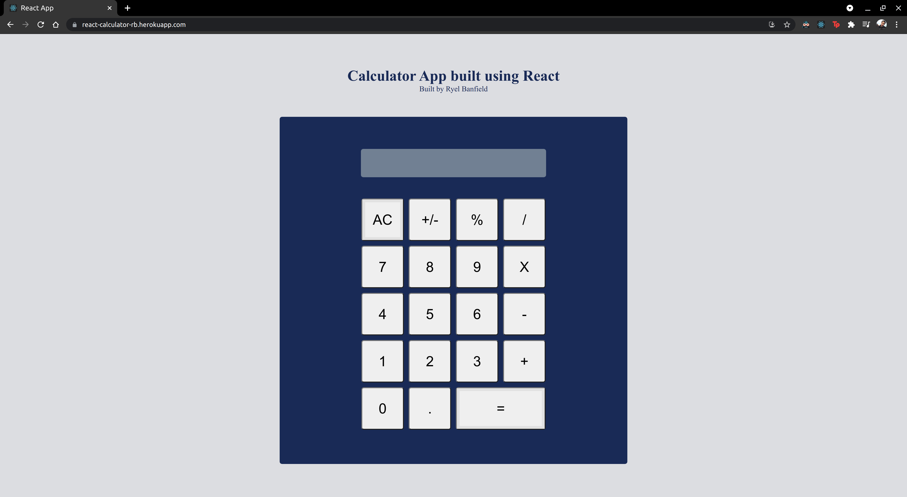

# React Calculator

[Click here to view live demo](https://react-calculator-rb.herokuapp.com/)

A calculator web app built using React. Hosted on Heroku. 

Additional description about the project and its features.

## Built With
- JavaScript
- React

## Getting Started
- Download or clone this repo by using `git clone https://github.com/RyelBanfield/react-calculator.git`
- Enter the project folder and run `npm i`.
- To run the tests, run `npm run test`.
- To run the local server, run `npm start`.

## Author
👤 **Ryel Banfield**
- GitHub: [@RyelBanfield](https://github.com/ryelbanfield)
- Twitter: [@RyelBanfield](https://twitter.com/ryelbanfield)
- LinkedIn: [Ryel Banfield](https://www.linkedin.com/in/ryel-banfield/)

## 🤝 Contributing
Contributions, issues, and feature requests are welcome!

Feel free to check the [issues page](../../issues/).

## Show your support
Give a ⭐️ if you like this project!

## Acknowledgments
- Hat tip to anyone whose code was used
- Inspiration
- etc

## 📝 License
This project is [MIT](LICENSE) licensed.
